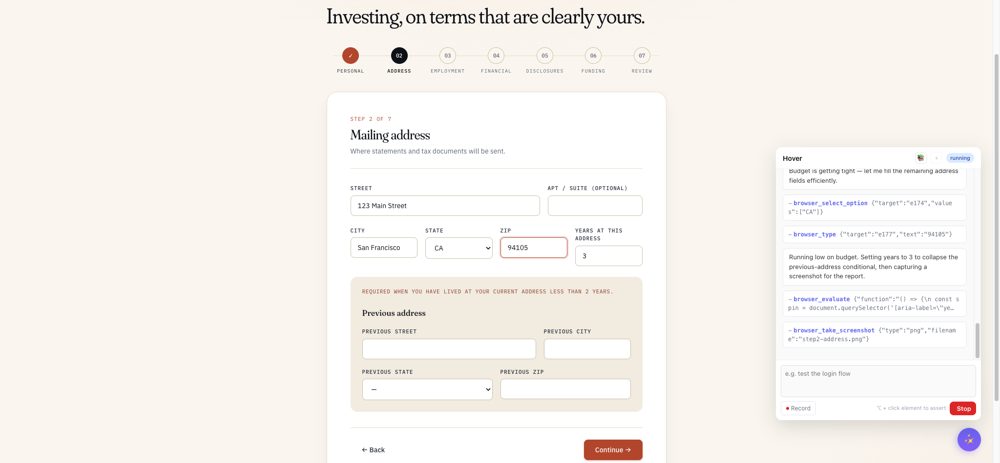

<div align="center">

# Hover


<p>
  <b>English</b> · <a href="./README.zh-CN.md">简体中文</a>
</p>

<p>
  <a href="./LICENSE"></a>
  <a href="https://github.com/Hyperyond/Hover/releases"></a>
  <a href="#roadmap"></a>
  <a href="https://github.com/Hyperyond/Hover/stargazers"></a>
  <a href="https://github.com/Hyperyond/Hover/network/members"></a>
  <a href="https://github.com/Hyperyond/Hover/commits/main"></a>
  <a href="#how-it-works"></a>
</p>

</div>

---

Open the floating chat in your dev page, describe what you want to verify in plain English, watch AI operate your app for real. When the run is clean, click **Save as spec** — Hover writes a standard `@playwright/test` file you can run in CI without an agent in the loop, forever.

```
┌──────────────────────────────────────────────────────────┐
│  type natural language ── AI drives your Chrome via CDP  │
│              │                                           │
│              ▼                                           │
│       browser_click, browser_type, …  (Playwright MCP)   │
│              │                                           │
│              ▼                                           │
│   verified session ── Save as Playwright spec ──┐        │
│                                                 ▼        │
│                       __vibe_tests__/login-flow.spec.ts  │
│                       (plain @playwright/test, no agent) │
└──────────────────────────────────────────────────────────┘
```

## See it in action

<table>
<tr>
<td width="50%" valign="top" align="center">
<sub><b>01 · Floating widget on your dev page</b><br/><i>(coming soon)</i></sub>
</td>
<td width="50%" valign="top">
<br/>
<sub><b>02 · AI driving a real form</b> — The agent is filling out the brokerage stock-registration example mid-flow. Notice the status pill is <code>running</code>, the Send button has turned into <code>Stop</code>, and the right rail streams every <code>browser_*</code> tool call live so you can interrupt the moment it goes off-script.</sub>
</td>
</tr>
<tr>
<td width="50%" valign="top" align="center">
<sub><b>03 · Save as Playwright spec</b><br/><i>(coming soon)</i></sub>
</td>
<td width="50%" valign="top" align="center">
<sub><b>04 · The saved spec running in CI</b><br/><i>(coming soon)</i></sub>
</td>
</tr>
</table>

## Why Hover

Three things in this space already exist; Hover is what falls out when you combine them honestly:

| Tool | What it does | What's missing |
|---|---|---|
| **Playwright Codegen** | Records your clicks → spec | Can't think; just replay |
| **Stagehand / Midscene** | AI drives the browser at test time | Agent stays in the loop forever — slow, flaky, $$$ |
| **Hover** | AI drives the browser **once** to explore; saves a deterministic spec | The agent's job ends at "save"; CI runs plain Playwright |

The differentiator is the handoff. AI authors the test; the artifact is decoupled from AI.

## What you get when Phase 1 ships (this release)

- **Vite plugin** that injects a Shadow-DOM widget into your dev page. No-op in production. Marked `data-hover="true"` so your own Playwright runs can skip it.
- **Local Node service** on `127.0.0.1` that bridges the widget to a coding-agent CLI on your PATH (`claude` today; `codex` / `cursor` / `aider` are a one-file addition).
- **CDP-attached browser driving** — Hover talks to *your* Chrome (the one you're already debugging in), never spawns a fresh Chromium. Cookies, dev-tools state, the page you were inspecting — all preserved.
- **Save as Playwright spec** → `__vibe_tests__/<slug>.spec.ts`, uses `getByRole / getByLabel / getByTestId` semantic selectors derived from the agent's element descriptions.
- **Save as Skill** → `.claude/skills/<slug>/SKILL.md`, replayable by saying *"execute login-as-claude"* in a future conversation.
- **Alt-click "Assert This"** — Hold ⌥, click any element in your page, get a generated assertion (`expect(...).toHaveValue / toBeChecked / toHaveText / …`). Assertions accumulate; the next *Save as spec* bakes them in.
- **Record mode** — Toggle 🔴 Record, do the flow manually, get the same step sequence as if the agent had driven it. The downstream save path doesn't care whether the steps came from a human or from Claude.
- **Session persistence + resume** — Widget state survives page reload via `localStorage`; the next prompt resumes the same `claude --session-id`.
- **Strict agent sandbox** — Only the Playwright MCP server is callable. `Bash`, `Edit`, `Write`, `Read`, `WebFetch`, etc. all explicitly denied. `--max-budget-usd 0.50` hard ceiling per session.

## Quick start

You need three terminals on first run. Once Chrome and Vite are up, they stay running across many loops.

```bash
git clone https://github.com/Hyperyond/Hover.git
cd Hover
pnpm install
pnpm --filter basic-app exec playwright install chromium   # for `pnpm test:e2e` only
```

```bash
# Terminal 1 — debug-mode Chrome on port 9222, isolated profile
pnpm smoke:chrome
```

```bash
# Terminal 2 — basic-app on http://localhost:5173
pnpm dev:example:basic-app
```

```bash
# Terminal 3 — run the AI smoke loop (CDP preflight → invoke claude → stream events)
pnpm smoke
# or with custom target + prompt:
pnpm smoke http://localhost:5173/ "log in then add a todo named 'verify hover'"
```

Or just open `http://localhost:5173/` in the debug Chrome, click the ✨ floating button, and type into the widget.

## Install

```bash
pnpm add -D @hyperyond/vite-plugin
# or:  npm install -D @hyperyond/vite-plugin
# or:  yarn add -D @hyperyond/vite-plugin
```

That's it — no `.npmrc`, no auth tokens. The `@hyperyond/*` packages are public on npmjs.com.

Then start Chrome in debug mode so Hover can connect:

```bash
# macOS
/Applications/Google\ Chrome.app/Contents/MacOS/Google\ Chrome \
  --remote-debugging-port=9222 \
  --user-data-dir=/tmp/hover-chrome
```

Open your dev server in *that* Chrome window. The ✨ launcher appears bottom-right.

## Use it in a React (Vite) project

```ts
// vite.config.ts
import { defineConfig } from 'vite';
import react from '@vitejs/plugin-react';
import { hover } from '@hyperyond/vite-plugin';

export default defineConfig({
  plugins: [
    react(),
    hover(),                 // 👈 add this line
  ],
});
```

That's the whole integration. `vite dev` as usual; open your app in the debug Chrome; click ✨.

> Verified specs that you save via the widget land in `__vibe_tests__/` at your project root. Run them with `npx playwright test`. They import only `@playwright/test` and have no runtime dependency on Hover — so CI can run them with the widget completely disabled.

## Use it in a Vue (Vite) project

```ts
// vite.config.ts
import { defineConfig } from 'vite';
import vue from '@vitejs/plugin-vue';
import { hover } from '@hyperyond/vite-plugin';

export default defineConfig({
  plugins: [
    vue(),
    hover(),                 // 👈 add this line
  ],
});
```

Same flow. Vite dev server → debug Chrome → ✨.

> Works the same in Svelte / Solid / Qwik / Astro / vanilla — anything Vite serves. The plugin is framework-agnostic; it just injects a Shadow DOM widget into your dev page via `transformIndexHtml`.

## Plugin options

```ts
hover({
  port: 51789,             // local WebSocket port; auto-bumps if taken
  enabled: true,           // false to disable (default: only in dev mode)
  chromeDebugPort: 9222,
  agentId: 'claude',       // matches @hyperyond/core's agent registry
  model: 'sonnet',         // 'opus' costs ~5× — use sonnet for browser driving
  maxBudgetUsd: 0.5,       // hard ceiling per agent invocation
});
```

## The five example apps

Each one is a real Vite app under `examples/` that stresses a different testing surface:

| App | Port | Stresses |
|---|---|---|
| [basic-app](./examples/basic-app) | 5173 | Login + counter + todos. Baseline smoke. |
| [e-commerce](./examples/e-commerce) | 5174 | Long action chains: product list → cart → checkout, cross-tab payment popup |
| [stock-registration](./examples/stock-registration) | 5175 | ~50-field brokerage form with conditional reveals — AI form-fill on rich controls |
| [canvas-paint](./examples/canvas-paint) | 5176 | DOM toolbar amidst `<canvas>` pixels — semantic selectors when snapshots are opaque |
| [payment-provider](./examples/payment-provider) | 5177 | Deliberately **no** Hover plugin — simulates a third-party origin in cross-tab flows |

Run any of them with `pnpm dev:example:<name>`.

## How it works

```
┌────────────────┐   chat (WebSocket)   ┌──────────────────┐
│  Widget        │ ───────────────────▶ │  @hover/core     │
│  (Shadow DOM,  │ ◀─────────────────── │  Node service    │
│   in dev page) │   step events        │  (127.0.0.1)     │
└────────────────┘                      └────────┬─────────┘
                                                 │ spawn
                                                 ▼
                                        ┌──────────────────┐
                                        │  claude (CLI)    │
                                        │  --strict-mcp,   │
                                        │  --allowedTools  │
                                        │  mcp__playwright │
                                        └────────┬─────────┘
                                                 │ MCP
                                                 ▼
                                        ┌──────────────────┐
                                        │  Playwright MCP  │
                                        └────────┬─────────┘
                                                 │ CDP (port 9222)
                                                 ▼
                                        ┌──────────────────┐
                                        │  Your Chrome     │
                                        │  (existing tab)  │
                                        └──────────────────┘
```

Architecture and boundary constraints live in [CLAUDE.md](./CLAUDE.md). Per-package internals in [packages/core/README.md](./packages/core/README.md).

## Built on the shoulders of

- [**`nexu-io/open-design`**](https://github.com/nexu-io/open-design) — the **Local CLI Agent First** architecture. Hover doesn't bundle any AI runtime; it `PATH`-scans for whatever coding-agent CLI the developer already has installed (`claude`, today) and treats it as a sidecar. The "local daemon as the only privileged process, agent-as-teammate" worldview, the strict-sandbox-by-default posture, and the per-invocation USD budget cap are all direct inspirations. Open Design proved the loop end-to-end for a *design* surface; Hover applies it to a *testing* surface, with the deterministic Playwright spec as the artifact instead of an HTML/PDF.
- [**Playwright Codegen**](https://playwright.dev/docs/codegen) — the *deterministic spec is the artifact* posture. AI authors are fashionable; AI runtime in CI is a recurring mistake. Hover keeps the artifact deterministic so CI never has to talk to a model.
- [**Stagehand**](https://github.com/browserbase/stagehand) and [**Midscene**](https://github.com/web-infra-dev/midscene) — proved that an LLM can usefully drive a real browser at test time. Hover takes the same loop and shortens it: agent drives the browser **once** during authoring, then steps out.

If your favourite agent (`codex`, `cursor-agent`, `aider`, `gemini`, `qwen-code`, …) isn't yet supported, it's a one-file addition in [`packages/core/src/agents/registry.ts`](./packages/core/src/agents/registry.ts) — PRs warmly welcome.

## Roadmap

- **v0.0.1-poc** — Phase 0 — end-to-end feasibility (`claude -p` drives Chrome via CDP) ✓
- **v0.1.x** — Phase 1 — Vite plugin + chat UI + persistent service + Save as Spec ✓ (you are here)
- **v0.2.x** — Phase 2 — multi-agent support (codex, cursor, aider), nicer step UI, error replay
- **v0.3.x** — Chrome extension (drop the Vite-plugin dependency for non-Vite stacks)

Phase 1 is what you can use today.

## Project status

🟢 **Phase 1 shipped** in v0.1.x — dogfood-ready. Use it on real Vite apps; expect some sharp edges around AI quirks (e.g., AI navigating to a same-origin URL still occasionally destroys the widget mid-stream; auto-resumes on reload).

Tracking issues at [github.com/Hyperyond/Hover/issues](https://github.com/Hyperyond/Hover/issues).

## Contributing

See [CONTRIBUTING.md](./CONTRIBUTING.md). TL;DR:

- Node 22+ / pnpm 10+
- Conventional Commits (enforced by `commit-msg` hook)
- `pnpm typecheck && pnpm test` before pushing
- Keep `main` runnable — speculative work on `experiment/<name>` branches

## License

[Apache-2.0](./LICENSE) © Hyperyond
