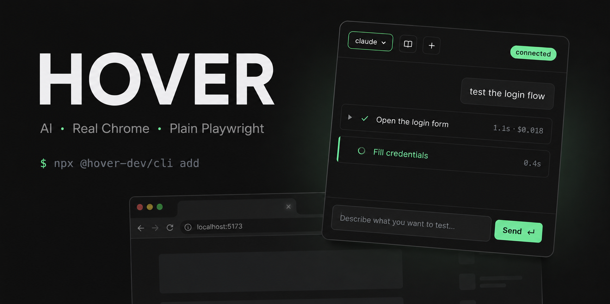
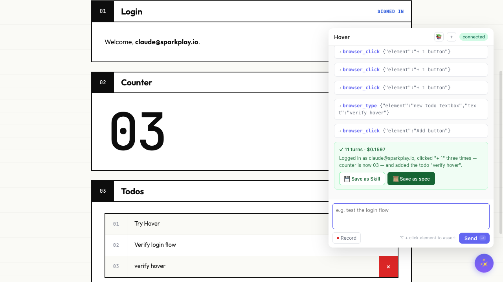
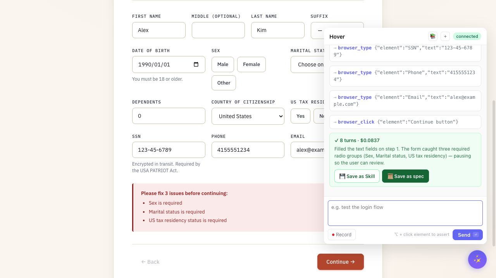
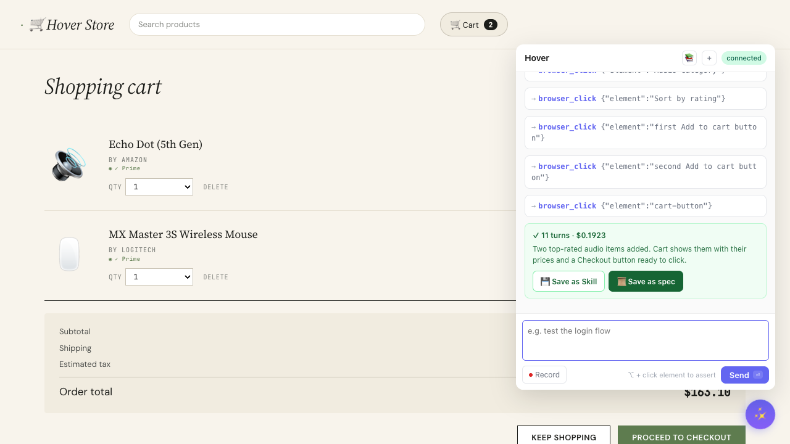
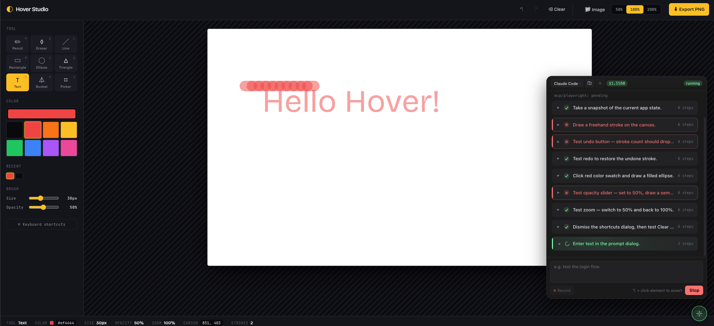
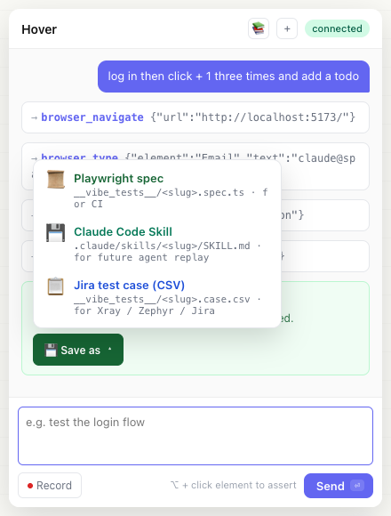
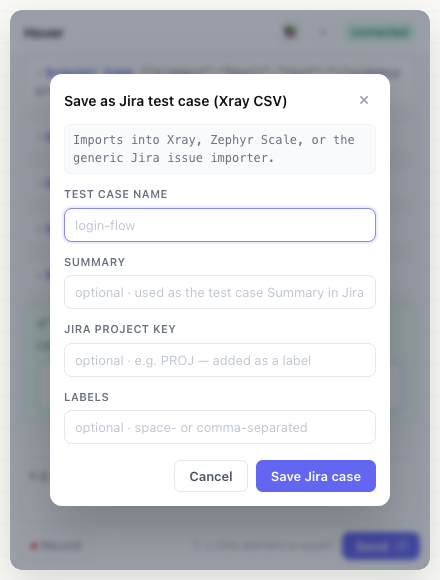
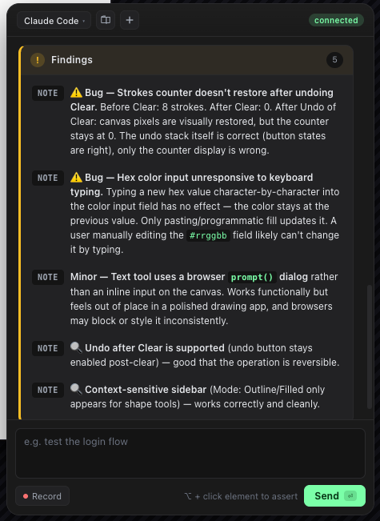
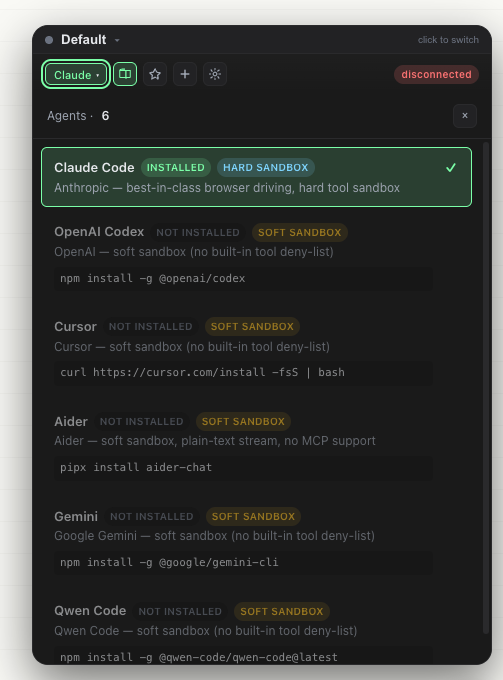
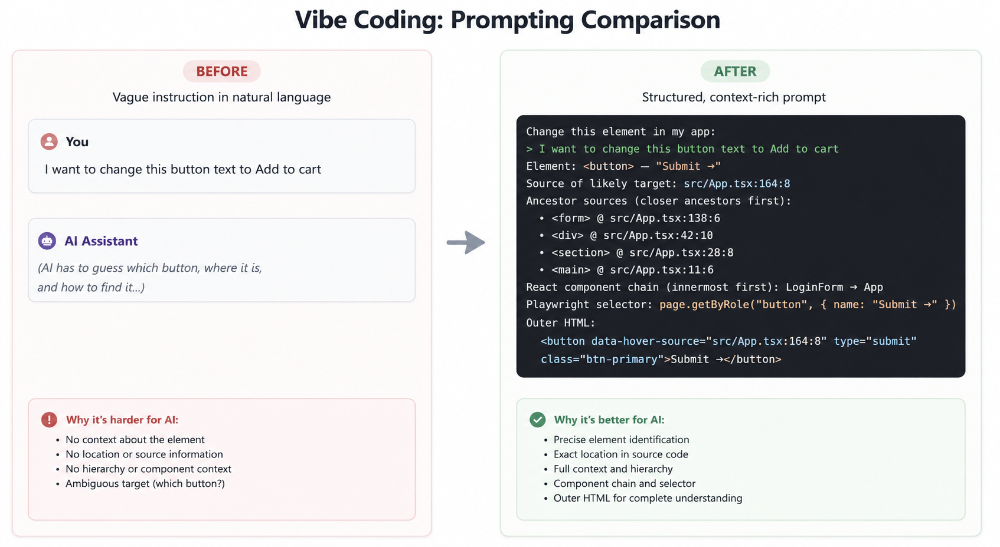

<div align="center">

# Hover



<p>
  <a href="./README.md">English</a> · <b>简体中文</b>
</p>

<!-- 能力 badges：能装什么 / 在哪能跑 -->
<p>
  <a href="./LICENSE"></a>
  <a href="https://www.npmjs.com/package/@hover-dev/cli"></a>
  <a href="#安装"></a>
  <a href="https://www.npmjs.com/package/@hover-dev/core"></a>
</p>

<!-- 项目 meta：release / 社区 / 架构 -->
<p>
  <a href="https://github.com/Hyperyond/Hover/releases"></a>
  <a href="https://github.com/Hyperyond/Hover/stargazers"></a>
  <a href="https://github.com/Hyperyond/Hover/network/members"></a>
  <a href="https://github.com/Hyperyond/Hover/commits/main"></a>
  <a href="#工作原理"></a>
</p>

</div>

---

在你的 dev 页面打开浮动聊天框，用中文（或者你喜欢的任何语言）描述要验证什么，看着 AI 真实地操作你的应用。一遍跑通后，点 **Save as spec** —— Hover 会写出一份标准的 `@playwright/test` 文件，CI 跑它的时候**完全不需要 AI 在场**。

**v0.7 新功能：** 装上 `@hover-dev/security`，同一个 widget 多出一个 **Security testing 模式** —— agent 检查捕获到的 API 调用并做 mutation 重放，探测 IDOR、越权、参数篡改、PII 泄漏。发现的问题同样落盘成 Playwright 测试。详见下文 [Security testing](#security-testing)。

**无需 API key，不按 token 计费。** Hover 调用你 `PATH` 上已经装好的 coding-agent CLI（claude / codex），跑在你已经付费的订阅里。

```
┌──────────────────────────────────────────────────────────┐
│  自然语言描述 ── AI 通过 CDP 驱动你的 Chrome              │
│         │                                                │
│         ▼                                                │
│   browser_click、browser_type … （Playwright MCP）       │
│         │                                                │
│         ▼                                                │
│   验证通过的会话 ── Save as Playwright spec ──┐         │
│                                                ▼         │
│                       __vibe_tests__/login-flow.spec.ts  │
│                       （纯 @playwright/test, 无 AI 依赖）│
└──────────────────────────────────────────────────────────┘
```

## 实际效果

<p align="center">
  <a href="https://www.youtube.com/watch?v=lQV5dmVWaIA">
    
  </a>
  <br/>
  <sub><b><a href="https://www.youtube.com/watch?v=lQV5dmVWaIA">▶ 在 YouTube 观看演示视频</a></b></sub>
</p>

[`examples/`](./examples/) 下有 10 个真实的示例 app。其中 4 个压**测试场景**（登录、多步表单、电商结账、画布 + DOM 混合）—— 右边的 Hover widget 都是同一套 UI 在驱动。另外 6 个压**bundler / 框架覆盖**（Astro、Nuxt、Next、webpack、React Native Web，加上电商弹窗流程里那个故意不装插件的第三方域）。

### 测试场景

<table>
<tr>
<td width="50%" valign="top">
<br/>
<sub><b>01 · <a href="./examples/basic-app"><code>basic-app</code></a> —— 烟雾基线。</b> 登录 → +1 计数 → 加 todo。Agent 11 turn 跑完整个流程，花了 $0.16；结果卡同时给出 <b>Save as Skill</b>（下次对话可复用）和 <b>Save as spec</b>（标准的 <code>@playwright/test</code> 文件）。</sub>
</td>
<td width="50%" valign="top">
<br/>
<sub><b>02 · <a href="./examples/stock-registration"><code>stock-registration</code></a> —— ~50 字段、条件展示的券商开户表单。</b> Agent 填完了文本字段，然后页面自带的校验逻辑标出三个必填 radio（性别 / 婚姻 / 美国税务居民）。Hover 停下来给一张说明清楚为什么停的 done card —— 人手动勾完那三个继续跑就行。</sub>
</td>
</tr>
<tr>
<td width="50%" valign="top">
<br/>
<sub><b>03 · <a href="./examples/e-commerce"><code>e-commerce</code></a> —— Amazon 风格电商。</b> "买两件销量最高的耳机，地址用我之前存的，刷卡。" Agent 选对了品类、加了两件商品、走到了支付步骤。长动作链、真实购物车状态、随时可以 <b>Save as spec</b>。</sub>
</td>
<td width="50%" valign="top">
<br/>
<sub><b>04 · <a href="./examples/canvas-paint"><code>canvas-paint</code></a> —— 一个画图 app，画布本身是不透明的 <code>&lt;canvas&gt;</code>。</b> 截图工具看不到像素内容，但 Agent 通过 DOM 工具栏（工具 · 颜色 · 笔刷大小 · 保存）一路操作下来 —— 证明 Hover 的"优先选语义化 selector" 策略在画布场景下依然好使。</sub>
</td>
</tr>
</table>

### Bundler 覆盖

下面六个目标的页面内容都一样（counter + todo 烟雾页），但底层 bundler / 框架不同 —— 每个 Hover 集成包都有自己专属的 dogfood 落点。

| 示例 | Bundler / 框架 | Hover 包 | 端口 |
|---|---|---|---|
| [`examples/astro-app`](./examples/astro-app) | Astro 5（静态，`astro dev`） | [`@hover-dev/astro`](./packages/astro-integration/) | 5178 |
| [`examples/nuxt-app`](./examples/nuxt-app) | Nuxt 4（SSR，`nuxt dev`） | [`@hover-dev/nuxt`](./packages/nuxt-integration/) | 5179 |
| [`examples/next-app`](./examples/next-app) | Next.js 16 App Router（Turbopack，`next dev`） | [`@hover-dev/next`](./packages/next-integration/) | 5182 |
| [`examples/webpack-app`](./examples/webpack-app) | vanilla webpack 5 + `webpack-dev-server` | [`webpack-plugin-hover`](./packages/webpack-plugin/) | 5180 |
| [`examples/rn-web-app`](./examples/rn-web-app) | React Native Web（Vite，`react-native` → `react-native-web` alias） | [`vite-plugin-hover`](./packages/vite-plugin/) | 5181 |
| [`examples/payment-provider`](./examples/payment-provider) | Vite，**故意不装** Hover 插件 | n/a | 5177 |

`payment-provider` 故意不装插件 —— `examples/e-commerce` 的 "Pay with PayHover" 按钮会把它弹到新标签页，Agent 要在没 widget 的情况下发现新标签页、切过去、操作完、再确认回调回到原标签页。

### React Native —— 只支持 Web 这一支

Hover 只服务"浏览器能跑起来"的前端。**React Native（iOS / Android 原生）不支持，也不在路线图上** —— Hover 的整套栈（Chrome DevTools Protocol + Playwright + Shadow DOM widget）跟原生移动端不沾边，那个领域有 [Maestro](https://maestro.mobile.dev/)、[Detox](https://wix.github.io/Detox/)、Appium 等专门工具。**React Native Web** 项目编译成纯 DOM，完整覆盖 —— 看 [`examples/rn-web-app`](./examples/rn-web-app/) 的接入方式（就一行 `react-native` → `react-native-web` 的 Vite alias）。

## 为什么是 Hover

这个领域已有几个不错的工具；Hover 跟它们的差异在另一个维度：**产物的可移植性**。

| 工具 | 它做什么 | 取舍 |
|---|---|---|
| **Playwright Codegen** | 录制你的点击 → `.spec.ts`。无 AI、无 auth | 不会思考——只能照搬你的点击 |
| **Stagehand / Midscene** | AI 增强的测试；两家都做了缓存，稳态 CI 跑命中缓存就跳过 LLM。需要配 **OpenAI / Anthropic API key**——cache miss 时按 token 计费 | 跑测试仍然需要**它们的 SDK + 仓库里那份缓存文件**。不可移植到普通的 Playwright runner |
| **Hover** | AI 只在**探索**时驱动浏览器一次；同时产出**确定性的 spec**、**可重放的 agent skill** 和**可直接导入 Jira 的测试用例**。**不需要 API key —— Hover 直接调用你 `PATH` 上已经装好的 coding-agent CLI**（claude / codex），跑在你已付费的 Claude Pro/Max 或 ChatGPT 订阅里 | 落盘的 spec 对 UI 改动是脆的——坏了就重跑 agent（CI 时不会自愈） |

Hover **不打算**做的事：当一个更好的"测试时 AI 运行时"。Stagehand 的缓存 + 自愈机制比我们能造的成熟，Midscene 的视觉 fallback 能处理 canvas / iOS / Android 目标我们碰不到。

Hover **要**做的事：**让落盘的产物就是纯 `@playwright/test` 代码，在干净机器上 `npx playwright test` 就能跑、零 AI 依赖**。AI 的工作到 "Save" 为止；CI 跑的就是纯 Playwright。这是交接点。

### 一次探索，三种受众

跑通的 Hover 会话可以以三种方式落盘。done card 上一个 **💾 Save as ▾** 下拉按钮展开三个选项，挑一个、两个、或都存。

- **📜 Save as spec** → `__vibe_tests__/<slug>.spec.ts` —— 标准 `@playwright/test` 代码，selector 用 `getByRole / getByLabel / getByTestId`。CI 跑、pre-commit 跑、新机器都能跑。不需要 agent，不需要 `claude` 二进制，不需要 API key。这是该流程的**ground truth**。**JSDoc 头部现在带一段编号的人话 `Steps:` 块 + `Expected:` 块**，QA / PM 不用打开 Playwright 文档就能读懂这个 spec 在干嘛。
- **💾 Save as Skill** → `.claude/skills/<slug>/SKILL.md` —— 一份可重放的指令集，agent 下次会话会自动发现。在未来任何一次会话里说一句 *"execute login-as-claude"*，记录的步骤会用同样的 Playwright MCP 沙箱、在你真实的浏览器里重新跑一遍。Skill 就是 Markdown 文件，跟着仓库走。
- **📋 Save as Jira case** → `__vibe_tests__/<slug>.case.csv` —— 多行格式 CSV，遵循 [Xray Test Case Importer](https://docs.getxray.app/display/XRAY/Importing+Manual+Tests+using+Test+Case+Importer) 规范（Manual Test 类型、每一步一行 Action、最后一行带 Expected Result）。直接拖进 Xray、[Zephyr Scale](https://support.smartbear.com/zephyr-scale-cloud/docs/en/test-management/test-cases/importing-test-cases.html) 或者原生 Jira issue importer，agent 跑过的流程就以**真实可追踪的测试用例**形态出现在 Jira 里 —— 立刻能分派、能挂到 story / sprint 上、能作为人工 Manual Test 跑。**再也不用把测试步骤从代码编辑器一行一行抄进 Jira。**

| | `📜 .spec.ts` | `💾 SKILL.md` | `📋 .case.csv` |
|---|---|---|---|
| **落在哪** | `__vibe_tests__/` | `.claude/skills/` | `__vibe_tests__/` |
| **谁读** | Node + Playwright (CI) | Claude Code / agent | Xray · Zephyr Scale · Jira issue importer |
| **受众** | CI、写代码的开发 | 未来探索时的你 | QA review · PM 追踪 · auditor 签字 |
| **确定性** | 硬合约 | 尽力重放 | 人工 review，人手动跑勾选 |
| **编辑方式** | 代码编辑器 | Markdown 编辑器 | 表格软件，或导入后用测试管理工具的 UI |

可以只存一种，也可以全存。Spec 给 CI，Skill 给下一次探索，Case 给测试团队和 sprint board —— 同一个会话、同一张 Save card。

<p align="center">
  
  
</p>

### 团队内可共享，不绑在工具里

三种文件都跟你代码一起 commit 进 git。一个前端开发把流程一存，剩下的所有人都能用 —— **不用装 Hover、不用 agent、不用 token**：

- **QA / 测试团队** clone 仓库跑 `pnpm test:e2e` 拿 spec 的确定性结果，*或者* 把对应的 `.case.csv` 拖进 Xray / Zephyr Scale / Jira，按 Manual Test 流程跑同一套步骤 —— 全程可追踪、可分派。不用装 Hover、不用配 Chrome、不用懂"agent"是什么。
- **其他前端** 在自己的 Hover widget 里调起已存的 skill —— *"execute login-as-claude"* 会在他们自己的浏览器 session 里重放记录的步骤。Skill 最适合不依赖特定用户数据或动态元素 ID 的流程，比如页面导航、表单填写模式、UI 探索路径等。
- **PR review** 把每个 spec 当成普通代码处理 —— 可 diff、可 blame、可 `requestChanges`。没有专有格式、没有 SaaS 仪表盘、没有"测试过了但看不到怎么过的"。
- **Sprint 规划 / PM 追踪** —— `.case.csv` 进 Jira 就是真实的 test issue，可以挂在 story 上、分派给测试、按 Manual Test session 跑。Jira board 上反映的就是这个 app **真能做**的事，不是"计划要做"。
- **新人 onboarding** 就是 `git clone && pnpm install && pnpm test:e2e`。测试套件本身就是这个 app 每条重要流程**怎么跑通**的活文档 —— 新人看真实浏览器走过真实场景。

所有东西都进 git。没有任何东西在某个供应商的数据库里。前端周一在本地写的 spec，QA 周二 review，周三在 CI 里跑 —— 同一个文件，无导出步骤。

## 你现在就能用的

- **每个 bundler 各一份插件。** Vite、Astro、Nuxt、Next.js（Turbopack）、webpack 5、React Native Web 全覆盖。插件往 dev 页面注入一个 Shadow DOM widget，生产构建里完全 no-op，并打上 `data-hover="true"` 标记让你自己的 Playwright 跑测试时自动跳过它。
- **🛡️ Security testing 模式（v0.7 新）。** 在原插件基础上装 `@hover-dev/security`，widget 会多出一个 Security 模式。debug Chrome 走本地 HTTPS MITM 代理；agent 能看到所有 API 调用、做 mutation 重放，探测 IDOR / 越权 / 参数篡改 / 缺失安全 header / PII 泄漏等问题。最终结晶为不依赖代理就能在 CI 跑的 Playwright 测试。详见下文 [Security testing](#security-testing-1)。
- **无需 API key、无需 `.env`、不按 token 计费。** Hover 调用你 `PATH` 上已经装好的 coding-agent CLI，跑在你已经付费的订阅里（Claude Pro / Max、ChatGPT Pro）。`@hover-dev/core` 这个包里没有任何 LLM SDK 代码——没有需要 auth 的东西。把你已付费的 agent 额度榨干。
- **多 agent。** `claude`（硬沙箱，推荐）和 `codex`（软沙箱）都已接入。服务启动时自动检测你 PATH 上装的哪个；widget 头部显示当前 agent 为 pill (`claude ▾`)，下拉可即时切换。`cursor-agent` / `aider` / `gemini-cli` 都是单文件加 registry 就能扩展。
- **按 agent 不同的沙箱策略。** 硬沙箱 agent（claude）显式 allow/deny，只剩 Playwright MCP 能被调用；`Bash` / `Edit` / `Write` / `Read` / `WebFetch` 等全部明确 deny；支持 `--max-budget-usd` 硬上限。软沙箱 agent（codex）CLI 没有内置工具 deny list，我们用 `--sandbox read-only` + 严格 `developer_instructions` 系统提示约束；widget 会给软沙箱 agent 加 ⚠ 标，让你知道工具面更宽。
- **Widget v2 —— 可扩展的信息层级。** 对话以每个自然语言意图为一行，而不是淹没在 `browser_click` 之类的 raw 事件里。工具调用详情折叠在 chevron 后；正在执行的 step 有 mint 左竖条 + spinner。深色面板、单一 mint accent、自定义 inline-SVG 图标 + 同主题 tooltip —— 让 widget 安静地浮在你的 dev 页面上，不抢戏。
- **Result + Findings 卡。** 一次 run 结束后，widget 把 agent 的验证报告渲染为独立的 Result 卡（markdown 已 strip，纯文本），Save-as 下拉就挂在它上面。如果 agent 总结里包含 `## Findings` 块——bug、轻微问题、观察——会单独抽出来渲染为 Findings 卡，每行带 severity 配色。Bug 发现是一等输出，不再淹没在叙述里。
- **CDP 直连专用 debug Chrome。** Hover 操作的是它在 `<tmpdir>/hover-chrome` 下启动的隔离 profile，不会动你的主 Chrome 配置，也不会启 headless Chromium。Cookie / 扩展 / DevTools 状态都不会从主浏览器迁过来——你在 debug Chrome 里登一次，profile 目录会复用，登录态能跨 Hover 指令和 dev server 重启保持。
- **三种结晶格式。**
  - **Save as Playwright spec** → 落盘到 `__vibe_tests__/<slug>.spec.ts`，selector 用 `getByRole / getByLabel / getByTestId`。JSDoc 头部带人话 Steps + Expected 块，方便非程序员 review。
  - **Save as Skill** → 落盘到 `.claude/skills/<slug>/SKILL.md`，未来对话里说一句 *"execute login-as-claude"* 就能重放。
  - **Save as Jira case** → 落盘到 `__vibe_tests__/<slug>.case.csv`，Xray 兼容的多行 CSV，直接导入 Jira / Xray / Zephyr Scale 成为 Manual Test issue。
- **录制模式自带检查** —— footer 切到 Record，手动跑一遍流程，得到跟 AI 驱动同样形状的 step 序列。录制时 sub-toolbar 让你切换下一次 click 捕获什么：
  - **● Record** —— 把 click / fill / select 录成 Playwright step（默认）
  - **✓ Exists** —— 检查元素出现：`expect(SEL).toBeVisible()`
  - **¶ Says** —— 检查元素文字一致：`expect(SEL).toHaveText("…")`
  - **= Equals** —— 检查 input / select / checkbox 当前值
  Check 模式是 one-shot —— 提交断言后自动跳回 Record。下游 Save 路径不在乎 step 是 AI 跑出来的还是你点出来的，action 和 check 一起烘焙进同一个 `.spec.ts`。
- **Fix prompt 按钮** —— Record 旁边一个独立的 **⌖ Fix** 按钮。点它，再点页面上任意元素，写下 *想改成什么*，Hover 把精准 prompt —— 源码 `file:line:col`、祖先源码链、React 组件链、Playwright selector、outer HTML —— 复制到剪贴板。粘贴到 Cursor / Claude Code / Windsurf，agent 拿到完整上下文。详见下文 [Fix prompt](#fix-prompt)。
- **会话持久化 + resume** —— widget 状态通过 `localStorage` 跨页面刷新存活；下次提示会接上同一个 `claude --session-id`。

### Security testing

> ⚠️ **仅限授权测试。** Hover 的 Security 模式针对的是你本机上的 dev server。把它指向你不拥有、未被书面授权测试的系统在大多数司法管辖区都违法，也违反本项目的 [Security Policy](./SECURITY.md)。agent 的系统提示词里已经约束了边界，但**最终责任在使用者本人**。

`@hover-dev/security` 是 Hover 的第一个可选插件。装上之后，widget 顶部会多一条模式切换条 —— 切到 **Security testing**，panel 边框和 launcher 都会变橙色，提示你处于"非默认状态"。

```bash
pnpm add -D @hover-dev/security
```

```ts
// vite.config.ts（Astro / Nuxt / Next / Webpack 同款形状）
import { hover } from 'vite-plugin-hover';
import securityMode from '@hover-dev/security';

export default defineConfig({
  plugins: [hover({}, securityMode())],
});
```

零外部依赖 —— 不需要 mitmproxy、Python、不污染系统 CA。底层用 [mockttp](https://github.com/httptoolkit/mockttp)（HTTP Toolkit 那个产品的引擎）做 HTTPS MITM，第一次启动时生成一次性 CA，通过 Chrome 的 `--ignore-certificate-errors-spki-list` 精准 pin —— OS trust store 完全不动。CA 私钥落在 `<项目>/.hover/ca/` 下，自带 `.gitignore` 已经把它排除。

**Agent 重点探测的范围**（优先级从高到低）：

1. **授权 / 认证** —— IDOR（改捕获到的 URL 里的资源 id 重发）、auth bypass（去掉或换 auth header）、参数篡改（mutate `user_id` / `role` / `price` / `isAdmin`）、mass assignment（POST body 里加 `admin: true`）。
2. **前端** —— XSS 注入、open redirect、缺失安全 header（CSP / X-Frame-Options / HSTS / SameSite）。
3. **合规 / 隐私** —— URL query string 里的 PII、未设 `Secure / HttpOnly / SameSite` 的会话 cookie、第三方请求在用户同意前就携带 PII。

**明确不在范围内** —— 系统提示词禁止 SQL 注入、SSRF、命令注入、反序列化攻击、自动 fuzzing 循环。浏览器驱动的测试无法有效覆盖这些类别；需要的话请用服务端扫描器（`sqlmap`、ZAP 等）。

模式启用期间 agent 会多拿到四个 MCP 工具：`list_flows`（枚举 API surface）、`get_flow`（完整 headers + body）、`replay_flow`（带 method / url / headers / body mutation 的重发）、`clear_flows`。发现的问题落盘成纯 Playwright spec，用 `page.request.fetch()` 复现 —— 你的 CI 用普通 `@playwright/test` 跑就行，不需要 Hover、不需要 mockttp。

完整教程见 [docs/features/security](https://hover-docs.vercel.app/features/security)。

### Bug 发现是一等输出

Agent 的验证报告和发现的 bug 在结束时落到独立卡片，不和 step 时间线混在一起。Result 卡里是文字总结（PASS / FAIL + 走的步骤）；Findings 卡列出 agent 标注的每个 `## Bug` / `## Minor` / `## Note`，按 severity 配色。

<p align="center">
  
</p>

system prompt 教 agent 每次结束都用这种结构化块输出，QA 读 spec 时不需要在 tool calls 里翻就能扫到 bug 列表。

### 自选 agent —— claude、codex，或自己加

Widget 头部显示当前 agent 的 pill，点开是 registry 里所有 agent 的下拉，标注哪些在你 PATH 上、哪些没装（带可复制的安装提示）。无需重启 dev server 即切。

<p align="center">
  
</p>

`claude` 是推荐默认（硬沙箱，工具面仅限 MCP）。`codex` 是二等公民（软沙箱——codex CLI 没暴露内置工具 deny list，我们靠它的 `--sandbox read-only` + 严格 `developer_instructions`）。Widget 会给软沙箱 agent 加 ⚠ 标。

加 `cursor-agent` / `aider` / `gemini-cli` 或你自己的 coding-agent CLI 只需要在 [`packages/core/src/agents/registry.ts`](./packages/core/src/agents/registry.ts) 加一个文件。

## Fix prompt

<p align="center">
  
</p>

Widget 知道页面上每个 host element 的源码位置 —— Vite transform 给每一个你在 JSX 里写的 `<button>` / `<div>` / `<input>` 都打上 `data-hover-source="file:line:col"`。点 Record 旁边的 **⌖ Fix** 按钮，再点任意元素，写下你想改什么，按 ⌘↵，Hover 把精准 prompt 拼好复制到剪贴板。粘贴到 Cursor / Claude Code / Windsurf，agent 立刻拿到完整上下文。

Prompt 是**纯事实**的 —— 没有 "请打开正确的文件" 这类多余指令（agent 会回声它,反而干扰），只有你的意图（markdown blockquote）和 Hover 观察到的事实:

```
Change this element in my app:

> Make this button red and add a loading spinner on click

Element: <button> — "Add to cart"
Source of likely target: src/components/ShadcnButton.tsx:42:11
Ancestor sources (closer ancestors first):
  • <div> @ src/routes/Cart.tsx:71:6
  • <section> @ src/routes/Cart.tsx:64:4
  • <main> @ src/App.tsx:11:6
React component chain (innermost first): ShadcnButton → CartLineItem → Cart → App
Playwright selector: page.getByRole("button", { name: "Add to cart" })
Outer HTML:
  <button data-hover-source="src/components/ShadcnButton.tsx:42:11" class="btn-primary">Add to cart</button>
```

两个细节值得注意：

- **Likely-target 自动下钻** —— 你点的是包按钮的 `<div>`，Hover 会自动把 prompt 的目标指向里面那个 button（绝大多数情况这就是你想要的）。被点的 `<div>` 会作为 "Clicked" 出现在 prompt 里给 agent 两个 anchor。
- **Ancestor chain 救场 wrapper-rendered hosts** —— `<StyledButton>` 渲染出的 `<button>` 来自 `styled-components` 库内部，Hover 的 transform 进不了库代码，所以元素**自己**的源码 stamp 会指向库内部。但 **DOM ancestor chain** 仍然带着你的调用站 —— 通常是你组件里包 `<StyledButton>` 的那个 `<div>`。Agent 读完 chain 自然落到正确文件。[`examples/basic-app/src/wrapper-lab.tsx`](./examples/basic-app/src/wrapper-lab.tsx) 实测了五种 wrapper 形态（裸 host、styled-components、className-forwarding、多层嵌套、Radix Slot/asChild），结论都写在文件头注释里。

**录制中可以直接点 Fix** —— Record 在 Fix popover 打开时自动暂停，popover 关闭（Submit 或 Cancel）时自动 resume。Record 按钮在 Fix 期间 disabled，避免误点结束 paused 的 session；Submit / Cancel popover 是唯一回到录制的路径。

## 快速开始

把 Hover 装进你已经在跑的项目里。一条命令、改一行配置，然后照常 `pnpm dev`。

**前置：** Node 22+，以及 `claude`（[安装](https://docs.claude.com/claude-code)）或 `codex`（[安装](https://developers.openai.com/codex)）任一在 `PATH` 上。**不需要新 API key** —— Hover 蹭你已付费的订阅。

**安装：**

```bash
npx @hover-dev/cli add
```

CLI 自动识别你的 bundler（Vite / Astro / Nuxt / Next.js / Webpack），装好对应的 Hover 包，并 AST 改你的 config 文件。幂等 —— 重跑安全。

**照常启动 dev server：**

```bash
pnpm dev          # 或者 `npm run dev` / `yarn dev` / `bun dev`
```

在任意 Chrome 打开你的 dev URL。右下角出现 ✨ launcher；点它，widget 会引导你启动一个隔离的 debug Chrome（9222 端口，跟你日常用的浏览器分开）。输入文字、或者按住 🎙 说出来：

```
登录，然后加一条名为 "verify hover" 的 todo
```

Agent 通过 CDP 操作 debug Chrome，每一步都有叙述，结束时渲染 Result + Findings 卡。点 **Save as Spec**，验证过的流程就落盘成 `__vibe_tests__/<slug>.spec.ts` —— 一个普通的 Playwright 测试，CI 跑它不需要 Hover、不需要 agent、不需要 API key。

> 想让 Hover 在 `pnpm dev` 时就预先把 debug Chrome 启好？给插件传 `autoLaunchChrome: true`，详见 [插件选项](#插件选项)。**它启的是 `:9222` 上的隔离 debug Chrome，永远不会动你的日常浏览器**。也可以随时手动启动：`pnpm exec hover-chrome`（或 `npx hover-chrome`）。

想给 Hover 自己开发（不是用它）？看 [Development](https://hover-docs.vercel.app/development/) 章节。

## 安装

**一条命令，零全局安装：**

```bash
npx @hover-dev/cli add
```

这个 CLI 会自动识别你的 bundler（Vite / Astro / Nuxt / Webpack），读 lockfile 决定用 pnpm / yarn / bun / npm 装包，装上对应的 Hover 包并 AST 改你的 config 文件。幂等 —— 重跑安全。

如果想强制走某个 bundler：

```bash
npx @hover-dev/cli add --vite      # vite-plugin-hover
npx @hover-dev/cli add --astro     # @hover-dev/astro
npx @hover-dev/cli add --nuxt      # @hover-dev/nuxt
npx @hover-dev/cli add --webpack   # webpack-plugin-hover
```

只想看不想动：`npx @hover-dev/cli add --dry-run`。

<details>
<summary>或者手动安装</summary>

```bash
pnpm add -D vite-plugin-hover     # Vite 项目
# 或者 `@hover-dev/astro`、`@hover-dev/nuxt`、`webpack-plugin-hover`
```

然后在 bundler 的 config 文件里手动加上 plugin/integration —— 详见 [`packages/`](./packages) 下对应包的 README。

</details>

不用 `.npmrc`、不用 token。所有包都是 npmjs.com 上的公开包。

**也不用填 `.env`。** Hover 不打包 LLM SDK，它会调用你 `PATH` 上已经装好的 coding-agent CLI —— `claude`（[安装](https://docs.claude.com/claude-code)）或 `codex`（[安装](https://developers.openai.com/codex)）。你已经登录的那个，直接就能跑。

接着直接跑你的 dev server：

```bash
pnpm dev
```

在**任意** Chrome 里打开 dev URL。右下角的 ✨ 浮动按钮会用颜色告诉你它现在的状态：

- **蓝色** —— 你正在 debug Chrome 里，直接点开聊天。
- **琥珀色** —— 还没 debug Chrome。点一下，widget 会自动拉起一个（profile 隔离在 `<tmpdir>/hover-chrome`，并直接打开你的 dev URL），然后提示你切过去用。
- **灰色** —— debug Chrome 在跑，但你不在那个窗口里。点一下，把那个窗口拉到前台。

希望 `vite dev` 时就预热好 Chrome？`hover({ autoLaunchChrome: true })`。喜欢自己手动开？`pnpm exec hover-chrome`（或 `npx hover-chrome`）。

## 在 React (Vite) 项目里用

```ts
// vite.config.ts
import { defineConfig } from 'vite';
import react from '@vitejs/plugin-react';
import { hover } from 'vite-plugin-hover';

export default defineConfig({
  plugins: [
    react(),
    hover(),                 // 👈 加这一行
  ],
});
```

集成就这一行。照常 `vite dev`，打开你的应用，点 ✨。按钮颜色会告诉你它还需要什么（如果有的话）。

> 通过 widget 保存的 spec 落在项目根目录的 `__vibe_tests__/` 下。用 `npx playwright test` 跑。它只 import `@playwright/test`，对 Hover 没有任何运行时依赖 —— 所以 CI 跑测试时 widget 完全可以禁用。

## 在 Vue (Vite) 项目里用

```ts
// vite.config.ts
import { defineConfig } from 'vite';
import vue from '@vitejs/plugin-vue';
import { hover } from 'vite-plugin-hover';

export default defineConfig({
  plugins: [
    vue(),
    hover(),                 // 👈 加这一行
  ],
});
```

流程完全一样。Vite dev 服务器 → debug Chrome → ✨。

> Svelte / Solid / Qwik / 原生 JS 都一样能用 —— **只要 Vite dev server 真正会跑用户 Vite 插件的 `transformIndexHtml`**，插件就跟具体框架无关。
>
> **Astro** 有自己的 HTML 管线，会绕过 `.astro` 页面的 `transformIndexHtml` —— 请用 [`@hover-dev/astro`](./packages/astro-integration/) 集成，它把同一套 service + widget 套在 Astro 的 `injectScript` API 上。
>
> **Nuxt** 通过 Nitro 渲染 HTML，不走 Vite，所以 Vite 的 `transformIndexHtml` 对 Nuxt 的 SSR 响应是 no-op —— 请用 [`@hover-dev/nuxt`](./packages/nuxt-integration/) 模块，它把 widget 推进 `nuxt.options.app.head.script`（Nitro 会内联到 SSR 出的 HTML 里）。
>
> **基于 Webpack 的项目**（vanilla `webpack-dev-server`、Rspack、Rsbuild、走 `craco` 的老 CRA、走 `configureWebpack` 的老 Vue CLI）—— 请用 [`webpack-plugin-hover`](./packages/webpack-plugin/)，它挂在 `HtmlWebpackPlugin` 的 `alterAssetTagGroups` 钩子上。
>
> **Next.js** 自 16 起默认使用 Turbopack，而 Turbopack 不加载 webpack 插件。`next dev --webpack` 模式的用户可以手动接 `webpack-plugin-hover`（详见包 README）。Turbopack 原生的 `@hover-dev/next` 已经在路线图上。

## 插件选项

```ts
hover({
  port: 51789,             // 本地 WebSocket 端口；占用了会自动顺延
  enabled: true,           // 设为 false 关闭（默认仅 dev 模式生效）
  chromeDebugPort: 9222,
  agentId: 'claude',       // 对应 @hover-dev/core 的 agent registry
  model: 'sonnet',         // 'opus' 大约贵 5×—— 浏览器驱动用 sonnet 完全够
  maxBudgetUsd: undefined, // 每次 agent 调用的 $ 硬上限；默认不设，让 widget 里的 Stop 按钮控住
  sourceAttribution: true, // 给 host JSX 元素打 data-hover-source="file:line:col"；
                           // 仅 dev 模式；如果跟别的工具冲突可以设 false 关掉
});
```

## 十个 example 应用

`examples/` 下每个都是真实可跑的应用，按"测试场景"和"bundler / 框架覆盖"两个维度铺开：

| 应用 | 端口 | 压什么 |
|---|---|---|
| [basic-app](./examples/basic-app) | 5173 | 登录 + 计数器 + todos。基线烟雾 · Vite + React |
| [e-commerce](./examples/e-commerce) | 5174 | 长动作链：商品列表 → 购物车 → 结账，跨标签页支付弹窗 · Vite + React |
| [stock-registration](./examples/stock-registration) | 5175 | ~50 字段的券商开户表单，含条件展示 —— AI 填写富控件的能力 · Vite + React |
| [canvas-paint](./examples/canvas-paint) | 5176 | `<canvas>` 像素中夹着 DOM 工具栏 —— 截图不透明时还能不能找到语义 selector · Vite + React |
| [payment-provider](./examples/payment-provider) | 5177 | **故意不装** Hover 插件 —— 模拟跨标签页流程里的第三方域 · Vite |
| [astro-app](./examples/astro-app) | 5178 | Astro 5 静态站点烟雾页 —— 验证 `@hover-dev/astro` 走 `injectScript` 注入 |
| [nuxt-app](./examples/nuxt-app) | 5179 | Nuxt 4 SSR 烟雾页 —— 验证 `@hover-dev/nuxt` 走 `app.head.script` 注入 |
| [next-app](./examples/next-app) | 5182 | Next.js 16 App Router 烟雾页（Turbopack 默认）—— 验证 `@hover-dev/next` 走 `withHover` + `instrumentation.ts` + `<HoverScript />` 注入 |
| [webpack-app](./examples/webpack-app) | 5180 | vanilla webpack 5 + `webpack-dev-server`，纯 JS 无 React —— 验证 `webpack-plugin-hover` 走 `alterAssetTagGroups` 注入 |
| [rn-web-app](./examples/rn-web-app) | 5181 | React Native Web —— `react-native` 通过 Vite alias 指到 `react-native-web`，编译到 DOM。证明 RN Web 在覆盖范围内（RN 原生不在） |

任何一个都用 `pnpm dev:example:<name>` 启动。

## 工作原理

```
┌────────────────┐   聊天 (WebSocket)   ┌──────────────────┐
│  Widget        │ ───────────────────▶ │  @hover/core     │
│  (Shadow DOM,  │ ◀─────────────────── │  Node 服务        │
│   在 dev 页面里) │   step 事件          │  (127.0.0.1)     │
└────────────────┘                      └────────┬─────────┘
                                                 │ 启动
                                                 ▼
                                        ┌──────────────────┐
                                        │  claude (CLI)    │
                                        │  --strict-mcp,   │
                                        │  --allowedTools  │
                                        │  mcp__playwright │
                                        └────────┬─────────┘
                                                 │ MCP
                                                 ▼
                                        ┌──────────────────┐
                                        │  Playwright MCP  │
                                        └────────┬─────────┘
                                                 │ CDP (9222 端口)
                                                 ▼
                                        ┌──────────────────┐
                                        │  你已开的 Chrome  │
                                        │  (现有标签页)     │
                                        └──────────────────┘
```

架构和边界约束写在 [CLAUDE.md](./CLAUDE.md) 里。各 package 的内部实现在 [packages/core/README.md](./packages/core/README.md)。

## 站在巨人肩膀上

- [**`nexu-io/open-design`**](https://github.com/nexu-io/open-design) —— **Local CLI Agent First** 架构的来源。Hover 不打包任何 AI 运行时；它扫描 `PATH`，把开发者已经装好的 agent CLI（当前是 `claude`）当作 sidecar 调用。"本地 daemon 是唯一特权进程、agent 是队友" 的世界观、默认严格沙箱的姿态、每次调用 USD 预算上限 —— 都是直接借鉴。Open Design 在**设计**这个 surface 上把这一套跑通了；Hover 把它搬到**测试** surface，产物从 HTML/PDF 变成确定性的 Playwright spec。
- [**Playwright Codegen**](https://playwright.dev/docs/codegen) —— "**产物必须是 deterministic 的**" 这个立场。AI 写测试是潮流；AI 跑在 CI 里是反复犯的错。Hover 保持产物 deterministic，让 CI 永远不用跟模型对话。
- [**Stagehand**](https://github.com/browserbase/stagehand) 和 [**Midscene**](https://github.com/web-infra-dev/midscene) —— 证明了 LLM 真的能驱动浏览器跑测试。Hover 拿同样的 loop，但把它**缩短**：agent 只在编写阶段驱动浏览器一次，之后就退出。

如果你想用的 agent（`codex` / `cursor-agent` / `aider` / `gemini` / `qwen-code` …）还没支持，去 [`packages/core/src/agents/registry.ts`](./packages/core/src/agents/registry.ts) 加一行就行 —— 欢迎 PR。

## 路线图

- **v0.0.1-poc** —— Phase 0 —— 端到端可行性验证（`claude -p` 通过 CDP 驱动 Chrome）✓
- **v0.1.x** —— Phase 1 —— Vite 插件 + 聊天 UI + 持久化服务 + Save as Spec ✓
- **v0.2.x** —— Phase 2 —— 多 agent（claude + codex）、深色 widget v2、Result + Findings 卡、自定义 tooltip、代码质量重构 ✓
- **v0.3.x** —— **`@hover-dev/next` —— Next.js 16+ Turbopack 原生集成** ✓。三件套 —— `withHover(nextConfig, opts)` 包 `next.config.mjs`、`<HoverScript />` Server Component 放进 `app/layout.tsx`、`register()` helper 放进 `instrumentation.ts`。现有 `webpack-plugin-hover` 只覆盖 `next dev --webpack`；这个包是 Turbopack 原生路径。`npx @hover-dev/cli add` 会自动把 Next 项目路由到这里。
- **v0.4.x** —— **点击元素 → 生成精准修复提示词。** ✓ 独立 footer Fix 按钮 + 元素 picker + 意图弹窗 + clipboard 传递。Vite transform 在每个 host JSX 元素上打 `data-hover-source="file:line:col"`（兼容 React 19 —— 用 `enforce: 'pre'` 跑在 `@vitejs/plugin-react` 把 JSX 折叠之前）。Picker 走 DOM ancestor chain 兜底 wrapper-rendered 元素（styled-components、className-forwarding、多层嵌套、Radix Slot/asChild —— 五种形态都在 `examples/basic-app/src/wrapper-lab.tsx` 实测过）。React 组件链来自 `_debugOwner`。Vue / Svelte 源码归因已规划但尚未发布。
- **v0.5.x** —— **Record + Assert 工作流合并** ✓。Record 模式内置 sub-toolbar：`● Record / ✓ Exists / ¶ Says / = Equals`。Check sub-mode 是 one-shot，跟 Playwright codegen 一致。Record 和 Fix 通过 pause-insert-resume 共存。
- **v0.6.x** —— **Voice mode** ✓。Push-to-talk 语音输入 + 进度朗读，纯浏览器原生（Web Speech API）。中文 / 英文 STT / TTS 自动检测，Chrome 139+ 通过 SODA 在本地跑识别引擎。⚙ 设置面板可关闭朗读。
- **v0.7.x** —— **Security testing + 插件 API** ✓ **（你在这里）**。`@hover-dev/security` 作为第一个可选插件发布：HTTPS MITM 代理（mockttp，零外部依赖）、widget 抓包面板、给 agent 的 MCP server（`list_flows / get_flow / replay_flow / clear_flows`），系统提示词限定在 authz / 前端 / 合规三类漏洞。背后的插件 API（`defineHoverPlugin` + 声明式 manifest + namespaced hooks）让第三方包能贡献 mode / MCP / Chrome 启动参数 / 提示词片段，不动 `@hover-dev/core`。
- **v0.8.x** —— 规划中 —— **多 tab / 跨 origin 完善 + 更多 agent + Chrome 扩展。**
  - 多 tab / 跨 origin 场景（Stripe、OAuth、"Pay with PayHover"）—— `examples/payment-provider` 已经压 `window.open` → `postMessage` 路径，但 agent 实际处理 `browser_tabs(list/select)` 在野外还是脆。
  - 更多 agent 接入 [registry](./packages/core/src/agents/registry.ts) —— `cursor-agent` / `aider` / `gemini-cli` / `qwen-code`。
  - Chrome 扩展（脱离 Vite 插件依赖，支持非 Vite 栈）。
- **v0.9.x** —— 规划中 —— **Security 模式下的录制语义。** 在 security 或其它探测模式启用时，把 Record 按钮重新定义：捕获 agent 的 replay 操作 + 断言服务端响应 shape，落盘成 security regression spec。

v0.7.x 是你今天能用的。

## 项目状态

🟢 **v0.7.0 已发布。** 全部六个宿主 bundler 都 dogfood 可用：Vite、Astro、Nuxt、Next.js (Turbopack)、webpack 5 和 React Native Web。v0.7 引入插件 API 并发布第一个可选插件 `@hover-dev/security` —— HTTPS MITM 代理 + 抓包面板 + agent 驱动的 IDOR / 越权 / 参数篡改探测，落盘为 Playwright 回归测试。前面的 arc：v0.6（Voice mode）、v0.5（Record + Exists / Says / Equals）、v0.4（点击 → Fix prompt + Vite 源码归因）、v0.3（Next.js Turbopack 原生集成）。

Issue 跟踪：[github.com/Hyperyond/Hover/issues](https://github.com/Hyperyond/Hover/issues)。安全问题报告走 [Security Policy](./SECURITY.md)。

## 贡献

见 [CONTRIBUTING.md](./CONTRIBUTING.md)。简要：

- Node 22+ / pnpm 10+
- Conventional Commits（`commit-msg` hook 强制）
- 推送前跑 `pnpm typecheck && pnpm test`
- 保持 `main` 可运行 —— 实验性工作放在 `experiment/<name>` 分支

## License

[Apache-2.0](./LICENSE) © Hyperyond
